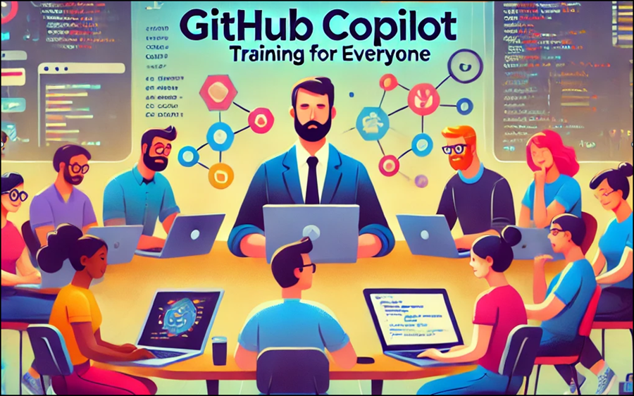

# Tim's GitHub Copilot All-in-One (AIO) Live Training Course

## Contact information

- [Tim Warner](mailto:timothywarner316@gmail.com)
- [LinkedIn](https://www.liiinkedin.com/in/timothywarner/)
- [Website](https://techtrainertim.com)
- [Bluesky](https://bsky.app/profile/techtrainertim.bsky.social)
- [Mastodon](https://mastodon.social/@techtrainertim)

## Sample application code

- [alekspopovic/simple-react-timeline](https://github.com/alekspopovic/simple-react-timeline)

## GitHub Copilot marketing

- [Marketing page](https://github.com/features/copilot)
- [Pricing](https://docs.github.com/en/billing/managing-billing-for-github-copilot/about-billing-for-github-copilot)
- [Trust Center](https://resources.github.com/copilot-trust-center/)
- [Blog](https://github.blog/)
- [GitHub Next](https://githubnext.com/)
- [GitHub Copilot VS Code extension](https://marketplace.visualstudio.com/items?itemName=GitHub.copilot)
- [GitHub Copilot Chat extension](https://marketplace.visualstudio.com/items?itemName=GitHub.copilot-chat)

## GitHub Copilot documentation

- [Docs](https://docs.github.com/copilot)
- [Quickstart](https://docs.github.com/en/copilot/quickstart)

## GitHub Copilot training and certification

- [Microsoft: AI-Powered Programming Video Course](https://www.microsoftpressstore.com/store/ai-powered-programming-with-github-copilot-video-9780138279455)
- [Microsoft: GitHub Copilot Fundamentals](https://learn.microsoft.com/en-us/training/paths/copilot/)
- [Prompts, tips, and use cases](https://github.blog/2023-06-20-how-to-write-better-prompts-for-github-copilot/)
- ["The Ultimate Manual"](https://nira.com/github-copilot/)
- [Essentials of GitHub Copilot](https://resources.github.com/learn/pathways/copilot/essentials/essentials-of-github-copilot/)
- [GitHub Copilot 101](https://github.com/microsoft/Mastering-GitHub-Copilot-for-Paired-Programming)
- [GitHub learning pathways](https://resources.github.com/learn/pathways/)
- [GitHub Copilot certification](https://examregistration.github.com/waitlist/copilot)
-

## Selected LLM interfaces and applications

- [Noi](https://github.com/lencx/Noi)
- [ChatGPT clone](https://github.com/lencx/ChatGPT)
- [LLMLingua](https://github.com/microsoft/LLMLingua)
- [Perplexity](https://www.perplexity.ai/)
- [Open Interpreter](https://www.openinterpreter.com/)
- [Backplain](https://backplain.com/)
